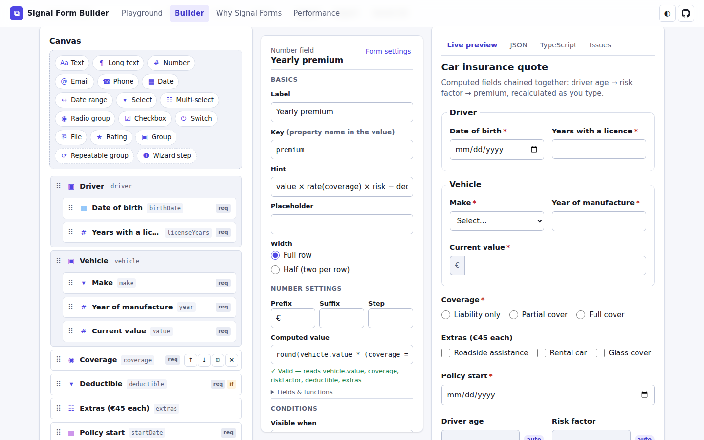
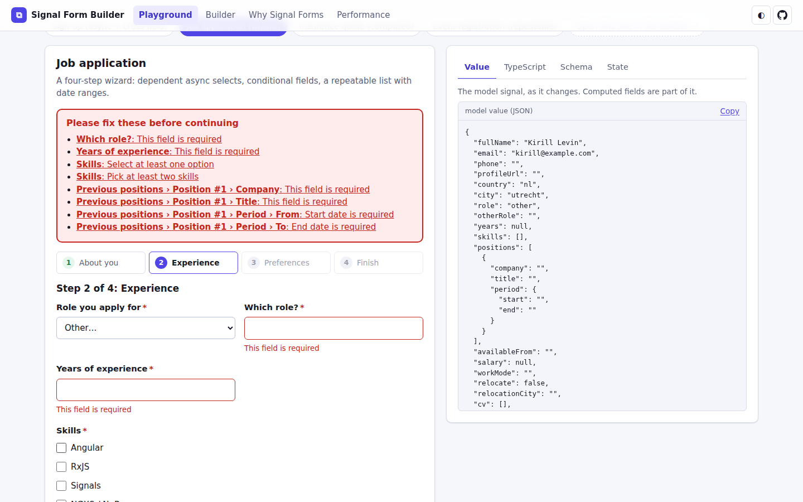
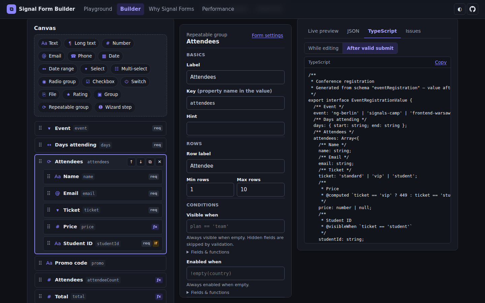
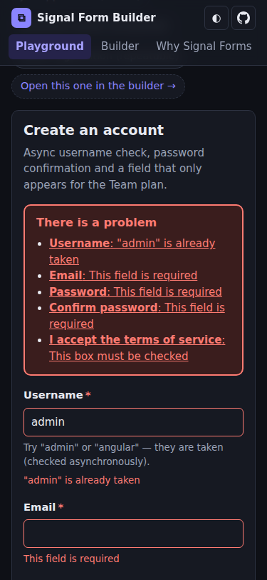
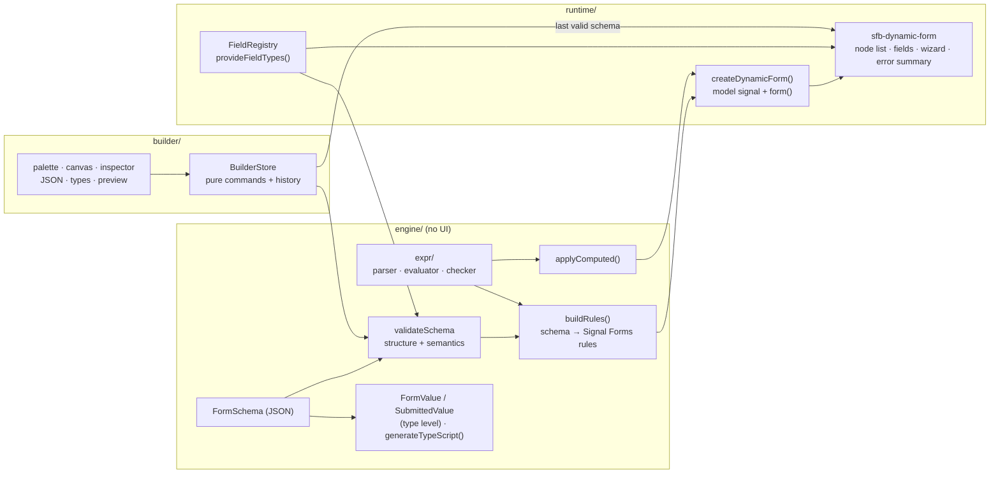
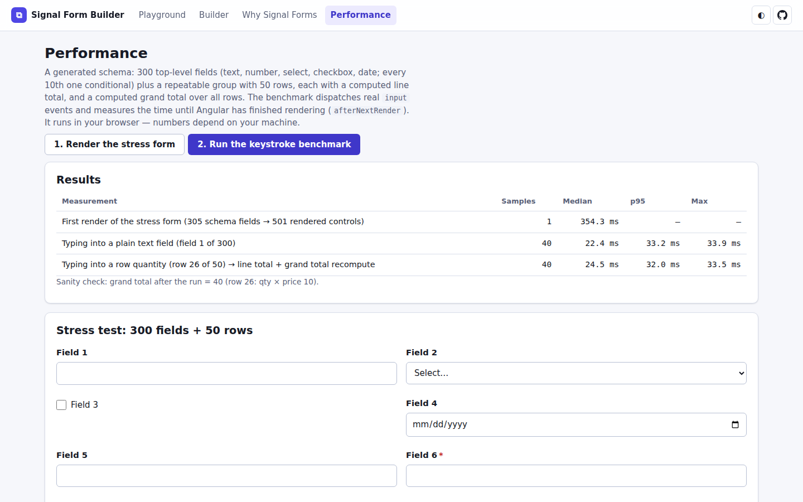

# Signal Form Builder

[](https://github.com/userTrv/signal-form-builder/actions/workflows/ci.yml)
[](LICENSE)

A dynamic form engine and a visual form builder on **Angular 22 Signal Forms** (`@angular/forms/signals`).
You describe a form as JSON: fields, conditions, cross-field and async validation, computed values,
repeatable groups, wizard steps. The engine turns that JSON into Signal Forms rules. The renderer
draws it with accessible controls. The builder lets you make the same JSON by dragging fields
onto a canvas. For schemas written in TypeScript, the value type of the form is inferred from
the schema literal, and the builder also emits it as generated TypeScript.

**Live demo: https://usertrv.dev/projects/signal-form-builder/**



| Wizard with a step-scoped error summary | Builder, dark theme, generated types | 375 px, dark |
| --- | --- | --- |
|  |  |  |

## Features

**Engine** (framework-free, except for the rule builder that targets Signal Forms)

- JSON schema format (`sfb/v1`) with 14 field types, groups, repeatable groups and wizard steps.
- A small, safe expression language for `visibleWhen`, `enabledWhen`, `requiredWhen`, `computed`
  and cross-field `checks`. It has its own parser and evaluator (no `eval`), whitelisted
  functions, lexical scoping (a repeat row sees its own fields first) and static checking,
  so the builder can flag unknown fields while you type.
- Validation: built-in rules (`required`, `min`/`max`, `minLength`/`maxLength`, `pattern`),
  named validators (`strongPassword`, `slug`, `minAge`, `futureDate`, …), cross-field checks
  with the error on a chosen field, and async validators with debounce and cancellation.
  Hidden and disabled fields are not validated.
- Computed fields (`sum(attendees.price)`, `age(driver.birthDate)`, …) are stored in the model,
  so they appear in the value and can be used by other expressions.
- Type-level inference: `FormValue<typeof schema>` (while editing) and
  `SubmittedValue<typeof schema>` (after a valid submit, with required unconditional fields
  narrowed). Also a TypeScript code generator for schemas only known at runtime.
- Schema validation in two stages: *structure* (never applied) and *semantics* (applied, and
  reported as issues).

**Renderer**

- `<sfb-dynamic-form [schema]>` renders any valid schema. The form is rebuilt when the schema
  changes, which the builder preview does on every edit.
- Accessibility: every control has a label, `aria-describedby` points to hints and errors,
  groups use `fieldset`/`legend`, and errors appear on blur or after a submit, not while you
  type. A GOV.UK-style error summary takes focus after a failed submit. Its links move focus
  to the field, and in a wizard they first switch to that field's step.
- Wizard: steps can only be reached in order, and "Next" validates only the current step.
  Focus moves to the step heading.
- Repeatable groups: add, remove and reorder rows; keyboard focus follows the row; rows keep
  their touched/dirty state when they move.
- Dependent async selects (the city list is loaded for the chosen country), phone masks,
  date ranges, file metadata, star ratings, light, dark and system themes.

**Builder**

- Palette → canvas drag and drop (CDK) with nesting into groups, repeats and steps, plus a
  keyboard route for all of it: click or Enter on a palette item adds it after the selection,
  ↑/↓ buttons reorder, and "Move to" + **Move** in the inspector moves between containers.
- Inspector for every property, with an expression editor that validates as you type and lists
  the fields and functions in scope.
- Undo/redo (Ctrl/⌘+Z, Ctrl/⌘+Shift+Z) with coalesced typing. Two-way JSON editing. Import and
  export as `.schema.json`. Named saves and an autosaved draft in `localStorage`, validated again
  when read back.
- Live preview that keeps showing the last valid schema while the current one has errors.
- The same four example forms as the playground, and "Open in the builder" links from it.

## Architecture



- `src/app/engine`: the schema format, the expression language, schema validation, rule
  building, computed values and type generation. It depends on nothing Angular-specific apart
  from `build-rules.ts`, which is the only file that calls the Signal Forms schema API. All
  the dynamic-typing casts live in that file.
- `src/app/runtime`: `createDynamicForm()` (a model `signal`, `form()` with the built rules,
  an effect for computed values, and submit/reset), the field registry, and the components.
- `src/app/builder`: `BuilderStore` holds the schema and its history. Components never mutate
  the schema: they call pure, immutable commands (`insertNode`, `moveNode`, …) that share
  untouched branches, so undo snapshots are cheap.
- `src/app/pages`: playground, "Why Signal Forms" (the sign-up form written with typed Reactive
  Forms and with Signal Forms, side by side) and the performance page.

## Schema format

```jsonc
{
  "$schema": "sfb/v1",
  "id": "signup",                       // also the name of the generated type
  "title": "Create an account",
  "submitLabel": "Create account",
  "fields": [
    {
      "type": "text", "key": "username", "label": "Username",
      "hint": "Try \"admin\" — it is taken.",
      "rules": {
        "required": true, "minLength": 3,
        "validators": [{ "name": "slug" }],
        "async": [{ "name": "usernameAvailable", "debounceMs": 400 }]
      }
    },
    { "type": "text", "key": "password", "label": "Password", "secret": true, "rules": { "required": true } },
    { "type": "text", "key": "confirmPassword", "label": "Confirm password", "secret": true, "rules": { "required": true } },
    { "type": "radio", "key": "plan", "label": "Plan", "default": "free",
      "options": [{ "value": "free", "label": "Free" }, { "value": "team", "label": "Team" }] },
    { "type": "number", "key": "seats", "label": "Seats",
      "visibleWhen": "plan == 'team'", "rules": { "required": true, "min": 2 } }
  ],
  "checks": [
    { "assert": "confirmPassword == password", "target": "confirmPassword", "message": "Passwords do not match" }
  ]
}
```

**Nodes**

| Node | Keyed by | Holds | Properties |
| --- | --- | --- | --- |
| field: `text`, `textarea`, `number`, `email`, `phone`, `date`, `date-range`, `select`, `multiselect`, `radio`, `checkbox`, `switch`, `file`, `rating`, or a custom type | `key` | a value | `label`, `hint`, `placeholder`, `default`, `width: 'half'`, `rules`, `computed`, plus type settings (`options` / `optionsSource`, `mask`, `prefix`/`suffix`/`step`, `rows`, `scale`, `accept`/`multiple`/`maxSizeMb`, `startLabel`/`endLabel`, `secret`) |
| `group` | `key` | an object | `label`, `hint`, `fields`, optional `checks` |
| `repeat` | `key` | an array of objects | `label`, `fields`, `itemLabel`, `minItems`, `maxItems`, `initialItems`, per-row `checks` |
| `step` | `id` | nothing (layout only) | `title`, `description`, `fields`. Only at the top level. A form is a wizard when all its top-level nodes are steps |

Every node can have `visibleWhen`, and every node except steps can have `enabledWhen`.

**Value shapes**: text-like fields hold `string`. `number` and `rating` hold `number | null`.
`checkbox` and `switch` hold `boolean`. `select` and `radio` hold one option value or `''`.
`multiselect` holds `string[]`. `date-range` holds `{ start, end }` as ISO dates. `file` holds
`{ name, size, type }[]`, because the files themselves never leave the browser.

**Rules** (`rules`): `required`, `requiredWhen` (an expression), `min`, `max`, `minLength`, `maxLength`,
`pattern: { regex, message }`, `validators: [{ name, args?, message? }]`, `async: [{ name, debounceMs?, message? }]`,
and `messages` (overrides by error kind).

**Options from a provider**: `"optionsSource": { "provider": "cities", "params": "country" }` loads the
options through `resource()` and reloads them when the value of the `params` expression changes.

**Expressions** read values by key: `plan`, `driver.birthDate`, `attendees.price` (the list of
`price` over all rows). A name resolves in the nearest scope that declares it, so inside a repeat
row `ticket` is the row's own ticket. Operators: `! - * / % + < <= > >= in == != && || ?:`, and list
literals `[a, b]`. Functions: `len`, `sum`, `avg`, `min`, `max`, `round`, `abs`, `empty`,
`contains`, `lower`, `today`, `age`, `daysBetween`. An expression is at most 500 characters
and 40 levels deep.

**Typed usage from code**

```ts
import { defineSchema } from './app/engine';
import { createDynamicForm } from './app/runtime/dynamic-form';

const SIGNUP = defineSchema({ id: 'signup', title: 'Sign up', fields: [/* … */] }); // or `as const`

// In an injection context (or pass `injector`):
const signup = createDynamicForm(SIGNUP, { onSubmit: (value) => api.save(value) });
signup.form.plan().value();  // 'free' | 'team' | '' (inferred from the options)
// onSubmit receives SubmittedValue<typeof SIGNUP>: required, unconditional fields are non-nullable.
```

For a JSON schema known only at runtime, use `createUntypedForm(schema)` or `<sfb-dynamic-form [schema]="schema" />`.

## Registering a custom field type

A field type is engine facts (value kind, allowed rules, TypeScript type) plus a component
that receives `field` (a Signal Forms `FieldTree`) and `node` (its schema node). The snippet
below is taken from [`custom-field-type.spec.ts`](src/app/runtime/custom-field-type.spec.ts),
so it is compiled and tested:

```ts
// 1. The component. BaseField gives ids, aria wiring and error visibility;
//    FieldShell renders the label, hint and errors.
@Component({
  selector: 'app-color-field',
  imports: [FieldShell, FormField],
  template: `
    <sfb-field-shell [node]="node()" [controlId]="id()" [hintId]="hintId()" [errorId]="errorId()"
                     [messages]="messages()" [required]="state().required()">
      <input type="color" [id]="id()" [formField]="field()" [attr.aria-describedby]="describedBy()" />
    </sfb-field-shell>
  `,
})
export class ColorField extends BaseField<string> {}

// 2. The value type, for FormValue / SubmittedValue inference (declaration merging).
declare module './app/engine/typegen/infer' {
  interface CustomFieldValues { color: string }
}

// 3. Register it, e.g. in the providers of app.config.ts.
provideFieldTypes({
  type: 'color', label: 'Colour', icon: '◐',
  valueKind: 'string',          // drives defaults and which validators apply
  rules: ['required'],          // the rules the builder offers for this type
  tsType: 'string',             // for generated TypeScript
  defaultValue: () => '#4f46e5',
  component: ColorField,
});
```

After that, `{ "type": "color", "key": "accent", "label": "Accent" }` is valid in schemas. The
renderer draws it, the builder palette offers it, and generated types use `string`.

## Tech decisions and trade-offs

- **Signal Forms, not Reactive Forms.** The model is a single `signal` that holds the whole
  value, and rules are declared per path (`hidden`, `disabled`, `validate`, `validateAsync`, `applyEach`).
  A condition is a reactive predicate instead of imperative `enable()`/`setValidators()` calls.
  The "Why Signal Forms" page shows the same form written both ways. In the installed Angular
  22.2 typings, the Signal Forms APIs used here are marked `@publicApi 22.0`. They were
  experimental in Angular 20–21, and their shape changed between those versions.
- **A custom expression language instead of JavaScript.** Schemas come from JSON, `localStorage`
  and file imports, so they are untrusted. A small Pratt parser with whitelisted functions
  cannot reach anything outside the form value. It can also be checked statically, which gives
  the builder its "Unknown field" errors and "reads: …" lists.
- **Computed values are stored in the model** by an effect. The effect writes back only when
  `applyComputed` returns a different object. This makes computed values part of the submitted
  value and usable in other expressions. The cost is one extra change-detection pass after an
  edit that changes a computed value.
- **The form instance is created inside a `computed`** (untracked), keyed on the schema, and each
  instance lives in its own child `EnvironmentInjector`. When the schema changes (on every builder
  edit), the old instance's effects and async-validation resources are destroyed with that
  injector. The trade-off is that a schema change resets the form state. That is fine for the
  builder preview; a production form does not change its schema while someone fills it in.
- **Async validation uses `validateAsync` + `resource()`.** The `debounce` option is Angular's
  `debounced()`. The fake-timer tests showed two details. First, a debounced value takes the
  value it has when it is first read as its initial value, without a timer. Second, while the
  next value waits for its debounce, the running request is not aborted: it is aborted when the
  next request starts, or its late result is discarded. So a superseded check can finish in the
  background, but it never shows a stale error.
- **Hash routing and `baseHref: "./"`**, so the static build works from any sub-path without a
  server fallback.
- **Pure builder commands plus snapshot history** instead of a command/inverse-command log.
  This is simpler, and the immutable schema keeps snapshots cheap (structural sharing).
- **CDK drop lists are connected deepest-first**, so a drop lands in the innermost container
  under the pointer. Drag and drop is never the only route: every drag has a keyboard or click
  equivalent.

## Measured numbers

I measured these on the **Linux cloud container this project was finished in** (Intel Xeon @ 2.80 GHz,
4 vCPUs, shared VM) in **headless Chromium 141** (the Playwright build), against the production
build, with the in-app benchmark on the Performance page. Each benchmark ran three times; you can
run it yourself on the live demo. Timings end at Angular's `afterNextRender`, so they include the
zoneless scheduler's wait for the next frame, which is long in headless Chromium on a VM. Expect
lower numbers in a desktop browser.

| Measurement | Result (3 runs) |
| --- | --- |
| First render of the stress form: 305 schema fields → 501 rendered controls | 353 / 358 / 375 ms |
| Keystroke → rendered, plain text field (40 samples per run) | median 20.6–22.4 ms, p95 24.6–31.1 ms |
| Keystroke → rendered, repeat-row quantity (recomputes the line total and the grand total over 50 rows) | median 22.3–24.9 ms, p95 32.3–35.7 ms |

Bundle size of the production build, measured on the emitted files (`gzip -9`):

| What loads | Raw | gzip |
| --- | --- | --- |
| Initial JS + CSS (`main`, `styles`) | 300 kB | 90 kB |
| Playground route, lazy chunks | 156 kB | 47 kB |
| Builder route, lazy chunks (the builder plus the renderer it shares with the playground) | 274 kB | 78 kB |

Tests: 154 unit and component tests (Vitest through `@angular/build:unit-test`, jsdom). They
include type-level tests that fail the build if inference regresses.



## Run, test, build

Requires Node ≥ 24.15 and pnpm 9.15.4 (`corepack enable`).

```bash
pnpm install
pnpm start          # dev server on http://localhost:4200
pnpm test           # unit and component tests (Vitest, jsdom), single run
pnpm lint           # angular-eslint, including template accessibility rules
pnpm build          # static site in dist/ (index.html at the root, works from any sub-path)
```

CI (`.github/workflows/ci.yml`) runs install with a frozen lockfile, lint, test and build on
every push to `main` and on every pull request.

## Limitations

- **Renaming a field key does not rewrite expressions that reference it.** The builder flags the
  broken references as "Unknown field" in the Issues tab and on the canvas. You fix them by hand,
  or undo the rename.
- **Hidden fields keep their values** in the submitted object. This is how Signal Forms works:
  hidden fields skip validation but stay in the model. For that reason `SubmittedValue` keeps
  their editing types (`''`, `null`, …).
- **Changing the schema resets the form** (see the trade-offs). This only matters for the builder
  preview.
- **Async validators and option lists use a mock backend** with artificial latency, because the
  demo is a static site. The seam is the `MockBackend` class, not a DI token, so plugging in a
  real backend needs a small refactor.
- **Drag and drop needs a pointer.** Keyboard users add fields with Enter on a palette item and
  move them with the ↑/↓ buttons and "Move to" in the inspector. This covers the same operations,
  in more steps.
- **Steps can only live at the top level.** Adding a step to a flat form wraps its existing fields
  into "Step 1" (one undo step). There is no one-click way back from a wizard to a flat form:
  use undo or edit the JSON.
- **An empty required multi-select with a minimum shows two errors** ("Select at least one option"
  and the `minLength` message).
- On phones the main navigation scrolls sideways, and the builder stacks its three panels,
  which makes a long page.

## License

[MIT](LICENSE) © 2026 Kirill Levin
